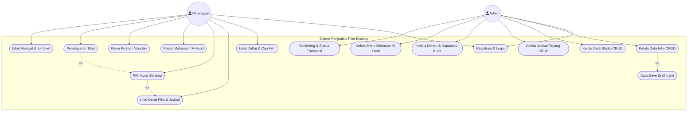
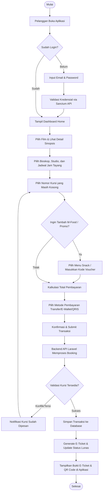
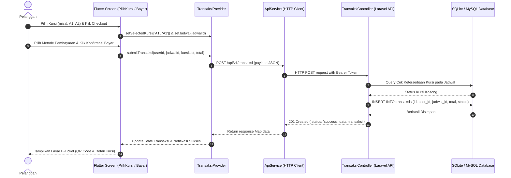
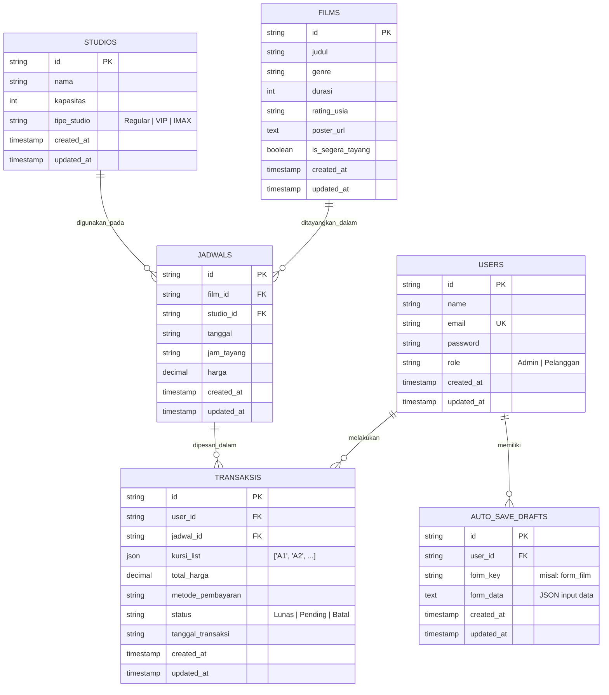

# Dokumentasi Diagram UML & ERD - Sistem Penjualan Tiket Bioskop

Dokumen ini berisi kumpulan diagram perancangan sistem (*UML*) dan basis data (*ERD*) untuk aplikasi **Sistem Penjualan Tiket Bioskop** (Frontend: Flutter, Backend: Laravel REST API).

Semua diagram di bawah ini dapat dilihat langsung di markdown preview dan juga telah diekspor ke dalam file `.drawio` di folder ini yang dapat dibuka langsung menggunakan **Draw.io / diagrams.net** atau ekstensi Draw.io di VS Code.

---

## Daftar File Diagram Draw.io
1. [`penjualan_tiket_diagrams.drawio`](./penjualan_tiket_diagrams.drawio) - Semua diagram dalam 1 file multi-halaman/tabs (Use Case, Activity, Sequence, ERD).
2. [`use_case_diagram.drawio`](./use_case_diagram.drawio) - Diagram Use Case
3. [`activity_diagram.drawio`](./activity_diagram.drawio) - Diagram Activity
4. [`sequence_diagram.drawio`](./sequence_diagram.drawio) - Diagram Sequence
5. [`erd_diagram.drawio`](./erd_diagram.drawio) - Diagram ERD (Entity Relationship)

---

## 1. Use Case Diagram

Diagram ini memetakan interaksi fungsional antara aktor (**Pelanggan** dan **Admin**) dengan sistem.

---

## 2. Activity Diagram (Alur Pemesanan Tiket Pelanggan)

Diagram aktivitas alur pemesanan tiket bioskop dari pemilihan film hingga mendapatkan E-Ticket.

---

## 3. Sequence Diagram (Proses Booking & Pembayaran Tiket)

Diagram urutan pemanggilan pesan dan eksekusi antar modul Frontend dan Backend API.

---

## 4. Entity Relationship Diagram (ERD)

Diagram struktur basis data dan relasi antar tabel (Database SQLite / MySQL Laravel).

